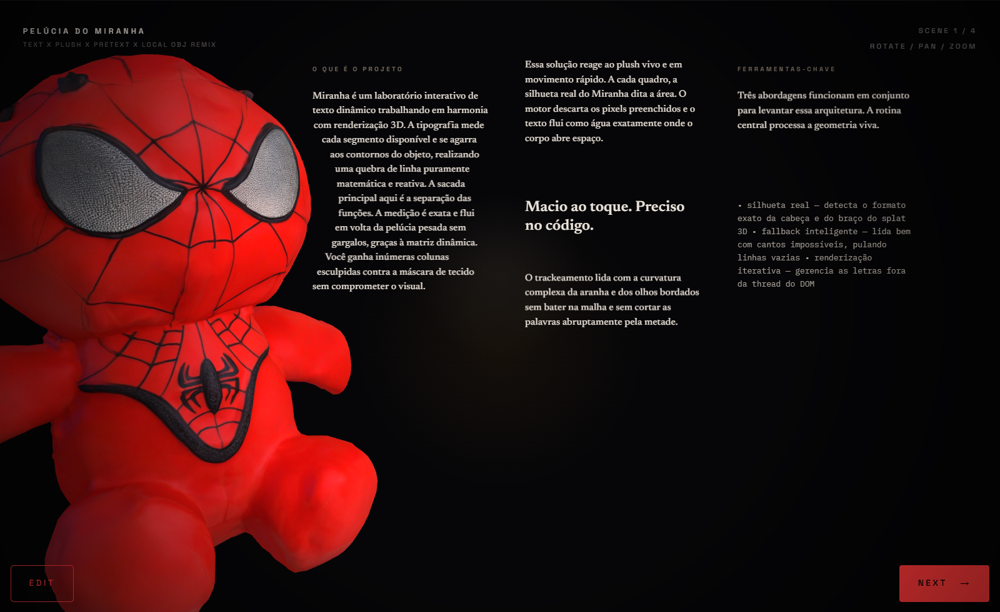
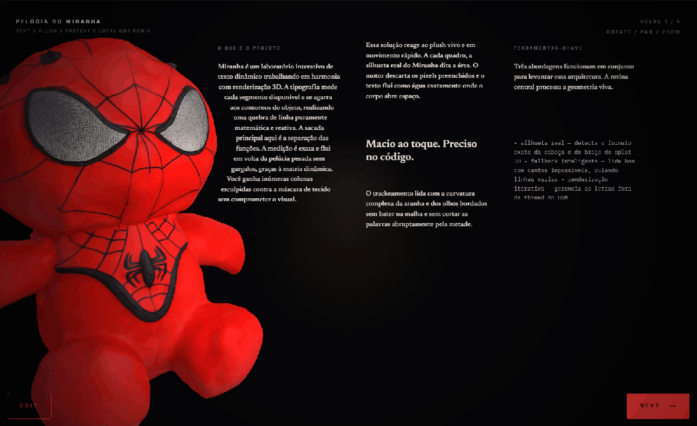
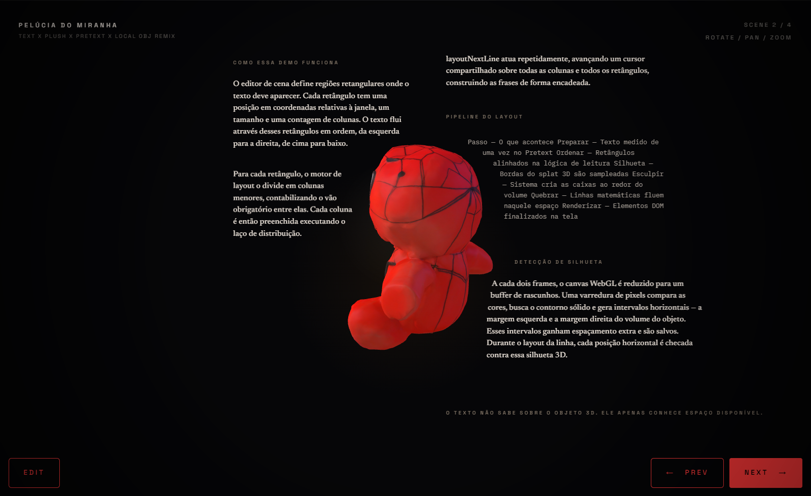
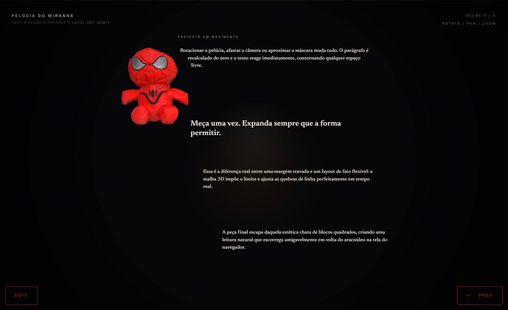
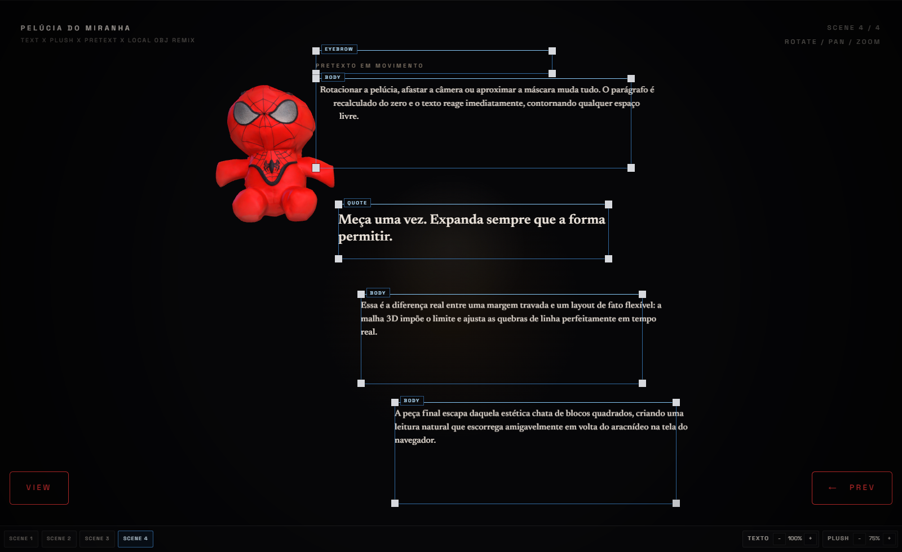
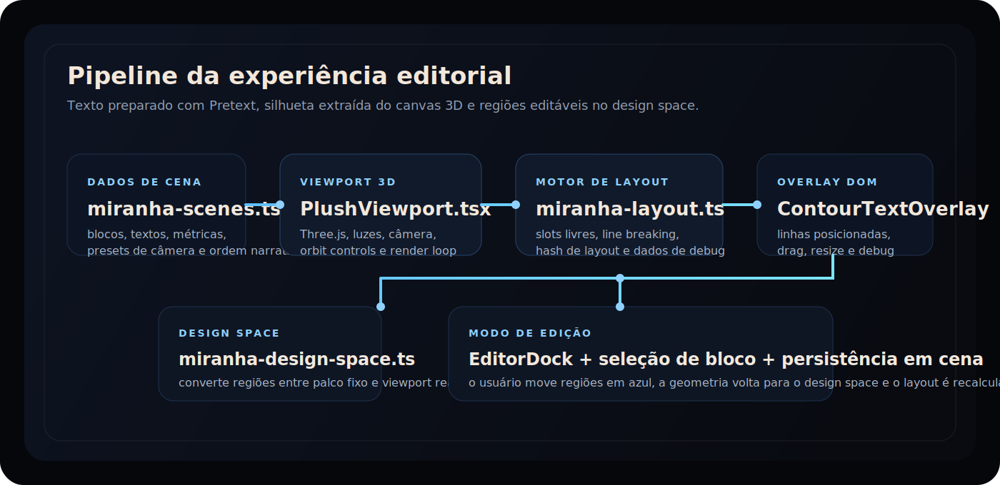

# Pelúcia do Miranha

<p align="center">
  Experiência editorial interativa em que uma pelúcia 3D do Miranha divide a cena com texto dinâmico que contorna a silhueta do modelo em tempo real.
</p>

<p align="center">
  
  
  
  
  
  
</p>

<p align="center">
  <a href="#preview">Preview</a> •
  <a href="#visão-geral">Visão geral</a> •
  <a href="#como-rodar">Como rodar</a> •
  <a href="#como-o-layout-funciona">Layout</a> •
  <a href="#roadmap">Roadmap</a>
</p>



## Preview



## Capturas

<table>
  <tr>
    <td width="50%">
      
    </td>
    <td width="50%">
      
    </td>
  </tr>
  <tr>
    <td colspan="2">
      
    </td>
  </tr>
</table>

## Visão geral

Experiência editorial interativa construída com React, TypeScript, Vite, Three.js e [Pretext](https://www.npmjs.com/package/@chenglou/pretext). O projeto combina uma pelúcia 3D do Miranha com texto que se reorganiza em tempo real ao redor da silhueta do modelo, criando uma interface que mistura direção de arte, layout responsivo e edição visual de regiões narrativas.

Hoje a aplicação principal não é mais o playground padrão do template Vite. A entrada da interface renderiza a experiência `SpidermanPretextExperience`, que aponta para a implementação editorial em `src/components/miranha/`.

O objetivo do projeto é demonstrar um fluxo de texto "obstacle-aware": em vez de colocar parágrafos em colunas fixas, o sistema mede o texto com Pretext, amostra a silhueta do modelo 3D no canvas WebGL e recalcula linha por linha o espaço realmente livre. O resultado é um bloco editorial que contorna a pelúcia em tempo real.

### Destaques

- navegação por cenas com câmeras e composições diferentes
- modo de edição para mover e redimensionar regiões de texto
- ajuste de escala tipográfica
- ajuste de escala do modelo
- painel visual com identidade editorial escura
- dados de cena separados da lógica de renderização
- fluxo de layout baseado em silhueta real do objeto 3D

## Stack

- React 19
- TypeScript
- Vite 8
- Three.js
- `@chenglou/pretext`
- Tailwind importado apenas como base global de estilo
- Fontes via `@fontsource`

## Como rodar

### Requisitos

- Node.js 20+ recomendado
- npm

### Desenvolvimento

```bash
npm install
npm run dev
```

Abra o endereço mostrado pelo Vite, normalmente `http://localhost:5173`.

### Build de produção

```bash
npm run build
```

### Preview local do build

```bash
npm run preview
```

### Lint

```bash
npm run lint
```

### Observação para Windows / PowerShell

Em alguns ambientes Windows, `npm.ps1` pode ser bloqueado pela política de execução do PowerShell. Se isso acontecer, use:

```bash
npm.cmd run dev
npm.cmd run build
```

## Estrutura do projeto

```text
pretext.js playground/
├─ public/
│  └─ spiderman/
│     ├─ Meshy_AI_Spider_Man_Plush_0414171926_texture.obj
│     ├─ Meshy_AI_Spider_Man_Plush_0414171926_texture.mtl
│     └─ Meshy_AI_Spider_Man_Plush_0414171926_texture.png
├─ Spiderman_obj/
│  └─ cópia de referência dos arquivos do modelo
├─ src/
│  ├─ components/
│  │  ├─ SpidermanPretextExperience.tsx
│  │  ├─ miranha/
│  │  │  ├─ ContourTextOverlay.tsx
│  │  │  ├─ EditorDock.tsx
│  │  │  ├─ EditorialHeading.tsx
│  │  │  ├─ MiranhaEditorialExperience.tsx
│  │  │  └─ PlushViewport.tsx
│  │  └─ arquivos legados do playground original
│  ├─ data/
│  │  ├─ miranha-scenes.ts
│  │  └─ miranha-theme.ts
│  ├─ lib/
│  │  ├─ miranha-design-space.ts
│  │  ├─ miranha-layout.ts
│  │  ├─ miranha-model.ts
│  │  └─ miranha-types.ts
│  ├─ styles/
│  │  ├─ globals.css
│  │  └─ miranha-editor.css
│  ├─ App.tsx
│  └─ main.tsx
└─ README.md
```

## Fluxo da aplicação

### 1. Entrada

- `src/main.tsx` carrega as fontes e os estilos globais.
- `src/App.tsx` renderiza `SpidermanPretextExperience`.
- `src/components/SpidermanPretextExperience.tsx` funciona como alias para `MiranhaEditorialExperience`.

### 2. Orquestração da experiência

O componente `src/components/miranha/MiranhaEditorialExperience.tsx` é o container principal. Ele coordena:

- viewport atual
- cenas clonadas a partir dos dados
- cena ativa
- layout calculado
- modo de edição
- escala tipográfica
- status de carregamento da cena
- bloco selecionado no overlay

Esse componente faz a ponte entre:

- `PlushViewport`: renderização 3D + amostragem da silhueta
- `ContourTextOverlay`: texto posicionado + guias editáveis
- `EditorialHeading`: marca e status
- `EditorDock`: navegação, toggle de edição e steppers

## Arquitetura visual



## Como o layout funciona

O coração do projeto está em `src/lib/miranha-layout.ts`.

### Resumo do pipeline

1. O modelo 3D é renderizado com Three.js.
2. O canvas WebGL é amostrado periodicamente para obter a silhueta horizontal do objeto.
3. Cada região de texto da cena é preparada com Pretext.
4. Para cada linha possível, o sistema calcula os intervalos livres naquela faixa horizontal.
5. O algoritmo escolhe o melhor slot legível e pede ao Pretext a próxima linha que cabe ali.
6. As linhas posicionadas são renderizadas no overlay DOM.

### O que isso resolve

Em um layout comum, a largura da coluna é fixa. Aqui, a largura útil muda a cada faixa vertical dependendo do quanto o corpo da pelúcia invade a área do texto. Isso permite:

- linhas mais largas quando a silhueta afina
- menos quebras ruins
- melhor ritmo de leitura
- composição visual mais próxima de uma peça editorial do que de uma coluna rígida

### Papéis dos módulos

#### `src/lib/miranha-layout.ts`

Responsável por:

- preparar texto com Pretext
- definir estilos por tipo de bloco
- criar colunas internas por região
- amostrar slots livres
- escolher o melhor espaço por linha
- gerar debug data do layout

#### `src/lib/miranha-design-space.ts`

Resolve a relação entre o palco de design fixo (`1600x920`) e o viewport real:

- converte coordenadas de design para viewport
- converte regiões editadas de volta para o espaço de design

Isso permite salvar regiões em coordenadas estáveis, independentes da resolução.

#### `src/lib/miranha-model.ts`

Cuida de:

- carregar `.mtl` e `.obj`
- centralizar o modelo
- escalar para a altura alvo
- aplicar pose por cena
- liberar materiais, texturas e geometria ao desmontar

## Silhueta e render 3D

O componente `src/components/miranha/PlushViewport.tsx` faz mais do que desenhar o modelo:

- cria o renderer Three.js
- configura câmera, luzes e `OrbitControls`
- atualiza o viewport responsivamente
- emite telemetria de interação
- calcula o layout em ciclos curtos
- evita recomputação desnecessária com `buildLayoutHash`

O layout é recalculado quando há mudança relevante em:

- câmera
- escala da fonte
- blocos da cena
- viewport
- silhueta capturada

## Modo de edição

O modo de edição é implementado principalmente por `src/components/miranha/ContourTextOverlay.tsx` e `src/components/miranha/EditorDock.tsx`.

### O que é editável

- posição da região
- largura
- altura
- cena ativa
- escala do texto
- escala do modelo

### Como funciona

- Cada bloco vira uma guia posicionada absolutamente no overlay.
- O drag move a região.
- O handle inferior direito ativa o resize.
- A alteração é convertida do viewport para o design space antes de ser salva.
- O layout é recalculado em cima da nova geometria.

### Destaques visuais

O modo de edição usa guias azuis, labels de bloco e chip ativo destacado em azul para facilitar leitura e seleção.

## Cenas e conteúdo

As cenas vivem em `src/data/miranha-scenes.ts`.

Cada cena define:

- `id`
- rótulos de navegação
- heading editorial
- métricas
- preset de câmera
- blocos de texto
- possíveis tags orbitais

Atualmente a experiência trabalha com quatro composições editoriais:

- close dramático
- frente heroica
- perfil ágil
- shelf layout

Os textos estão em português e devem ser mantidos em UTF-8.

## Estilos

Os estilos estão divididos em:

- `src/styles/globals.css`: base global, fontes, plano de fundo e setup geral
- `src/styles/miranha-editor.css`: layout visual da experiência editorial, overlay, dock e modo de edição

## Modelo 3D e assets

Os arquivos usados em runtime ficam em:

```text
public/spiderman/
```

O carregamento usa:

- `Meshy_AI_Spider_Man_Plush_0414171926_texture.obj`
- `Meshy_AI_Spider_Man_Plush_0414171926_texture.mtl`
- `Meshy_AI_Spider_Man_Plush_0414171926_texture.png`

O diretório `Spiderman_obj/` mantém uma cópia de referência do mesmo conjunto. Em produção, o app carrega os assets a partir de `public/spiderman/`.

### Se quiser trocar o modelo

1. Substitua os arquivos em `public/spiderman/`.
2. Se quiser manter o espelho manual, atualize também `Spiderman_obj/`.
3. Ajuste `MODEL_BASENAME` e, se necessário, a pose base em `src/lib/miranha-model.ts`.
4. Revise as cenas em `src/data/miranha-scenes.ts`, porque câmera e escala podem precisar de retoque.

## Personalização

### Alterar o nome da marca no header

Edite:

```text
src/data/miranha-theme.ts
```

### Alterar textos e regiões das cenas

Edite:

```text
src/data/miranha-scenes.ts
```

### Alterar o comportamento do layout

Edite:

```text
src/lib/miranha-layout.ts
```

Pontos comuns de ajuste:

- tamanho mínimo aceitável para slots
- espaçamento vertical
- estilos por tipo de bloco
- estratégia de escolha da melhor faixa livre

### Alterar o tamanho do palco de design

Edite:

```text
src/lib/miranha-design-space.ts
```

## Módulos legados

O repositório ainda contém componentes do playground anterior em `src/components/` e alguns utilitários antigos em `src/lib/`, como:

- `AdvancedModePanel.tsx`
- `ControlPanel.tsx`
- `LiveLayoutPanel.tsx`
- `MasonryPanel.tsx`
- `ObstacleAwarePanel.tsx`
- `PerformancePanel.tsx`
- `spiderman-content.ts`
- `spiderman-layout.ts`

Esses arquivos servem como referência histórica e experimentação, mas a aplicação ativa renderizada hoje é a experiência editorial em `src/components/miranha/`.

## Roadmap

| Status | Item | Objetivo |
| --- | --- | --- |
| ✅ | Experiência editorial principal | consolidar a nova interface `Pelúcia do Miranha` como app ativa |
| ✅ | Modo de edição com drag e resize | permitir direção de arte diretamente no overlay |
| ✅ | Captura de silhueta + layout com Pretext | provar o fluxo obstacle-aware em tempo real |
| ⏳ | Persistência das edições | salvar regiões por cena sem depender apenas do código-fonte |
| ⏳ | Controles de debug na UI | alternar colunas, silhouette rows, flow order e line boxes sem editar código |
| ⏳ | Export de cena | gerar imagem ou composição pronta para apresentação |
| ⏳ | Troca dinâmica de personagem/modelo | reutilizar a mesma arquitetura com outros plushes e presets |
| 💡 | Timeline / autoplay entre cenas | transformar a demo em apresentação guiada |
| 💡 | Comparativo visual antes/depois | mostrar coluna rígida versus layout contornado lado a lado |

## Troubleshooting

### O modelo não aparece

Verifique se os arquivos abaixo existem em `public/spiderman/`:

- `.obj`
- `.mtl`
- textura `.png`

Se o app mostrar erro de carregamento, a mensagem padrão aponta justamente para essa pasta.

### O texto ficou com caracteres quebrados

Salve os arquivos de conteúdo em UTF-8, especialmente:

- `src/data/miranha-scenes.ts`
- `src/data/miranha-theme.ts`

### O build funciona, mas o bundle ficou grande

O bundle atual da aplicação é relativamente pesado por combinar:

- Three.js
- fontes locais
- assets do modelo
- lógica de layout e render

Se quiser otimizar depois, um bom caminho é separar partes experimentais do projeto com `dynamic import()`.

## Próximos passos sugeridos

- persistir edição de blocos em arquivo exportável
- adicionar snapshots por cena
- ativar tags orbitais e backdrop na experiência principal
- expor flags de debug na interface
- permitir troca dinâmica de personagem/modelo
- criar export para imagem ou apresentação

## Resumo

Este projeto é uma peça híbrida entre demo técnica, experimento tipográfico e interface editorial interativa. Ele mostra como usar Pretext para quebrar texto de forma precisa em torno de um objeto 3D real, mantendo controle visual, performance razoável e editabilidade em cena.
